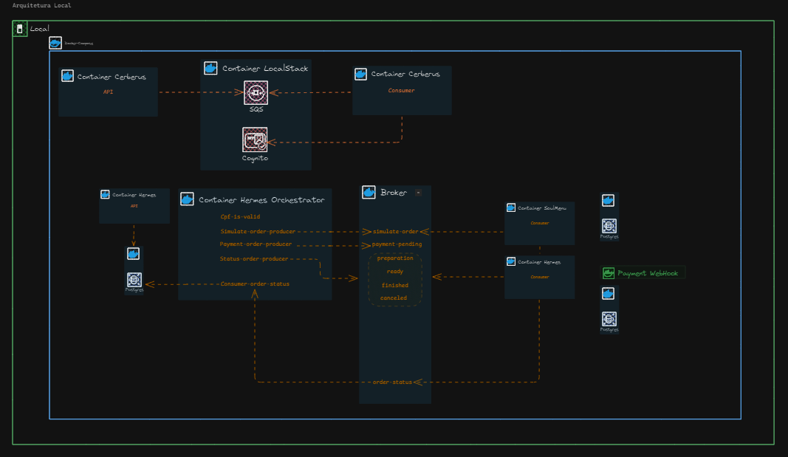
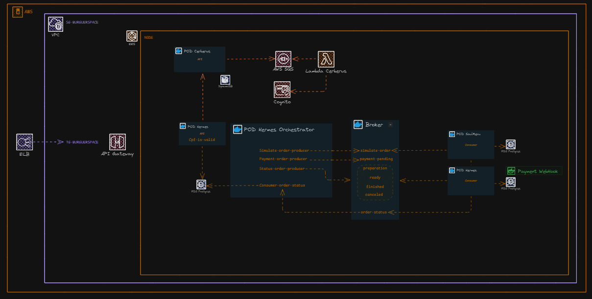

# Microserviço Soul Menu

**SoulMenu é o nome do meu microserviço responsável pela gestão de produtos de um menu para um sistema de restaurante.**

## Instruções para Rodar a Aplicação

1. **Pré-requisitos**:
   - Docker instalado.
   - Orquestrador de contêiner (como Docker Compose ou Kubernetes).

2. **Rodar usando Docker Compose**:
   - Clonar o repositório.
   - Executar: 
     ```bash
     docker-compose up --build
     ```
   - A aplicação será iniciada com todos os serviços necessários.
   - Importante ressaltar que o Soul Menu é uma parte de todo o processo. Se startar apenas ele, irá ser possivel usar as funções CRUD para os items do menu.

3. **Rodar com Kubernetes**:
   - Aplicar os manifests de Kubernetes:
     ```bash
     kubectl apply -f k8s/
     ```

4. **Arquitetura Local**:


## Justificativa do Padrão SAGA

**Arquitetura da Solução AWS**



Na arquitetura mostrada, o padrão Saga traz várias vantagens, especialmente em cenários distribuídos como o que envolve múltiplos serviços e mensagens, com componentes como AWS Lambda, SQS, API Gateway, e brokers intermediando comunicações. Aqui estão as principais vantagens:

1. Consistência Distribuída
O padrão Saga é ideal para garantir consistência eventual em transações distribuídas. Cada etapa do fluxo (como simulação de pedidos, pagamento e consulta de status) pode ser tratada como uma transação individual, com a garantia de que, se uma parte falhar, ações compensatórias serão executadas para manter o sistema consistente.

2. Resiliência a Falhas
Na arquitetura exibida, se uma etapa no processamento do pedido falhar (por exemplo, um problema no processamento de pagamento ou na consulta de status), o Saga pode acionar operações de compensação, desfazendo os passos anteriores de forma organizada. Isso evita que o sistema entre em estados inconsistentes, como por exemplo, marcar um pedido como "pagamento concluído" sem que o estoque tenha sido atualizado.

3. Desacoplamento de Serviços
Cada serviço (como o orquestrador, produtores e consumidores de filas) está desacoplado. O Saga orquestra as transações entre os serviços sem que eles precisem conhecer diretamente os detalhes uns dos outros. Isso melhora a modularidade e facilita a escalabilidade, pois novos serviços podem ser adicionados sem impactar diretamente os outros.

4. Escalabilidade
Ao dividir uma transação em etapas independentes, cada serviço pode escalar de forma independente, respondendo a picos de demanda sem afetar todo o sistema. Na sua arquitetura, serviços como Lambda e o Broker podem escalar horizontalmente para processar um número maior de pedidos ou pagamentos de forma eficiente.

5. Mecanismos de Compensação
O Saga permite definir claramente as etapas de compensação. Por exemplo, se a transação de pagamento falhar, o pedido pode ser automaticamente cancelado no sistema sem a necessidade de intervenção manual, e o status do pedido atualizado no broker. Isso automatiza o rollback das operações, economizando tempo e prevenindo erros humanos.

6. Visibilidade e Controle
O orquestrador Hermes centraliza o fluxo da transação, permitindo que cada passo seja monitorado e auditado. O sistema tem visibilidade de cada etapa, facilitando o rastreamento e controle do ciclo de vida dos pedidos, com logs claros e relatórios detalhados, o que pode ser fundamental para identificar e corrigir erros rapidamente.

7. Manutenção Simples e Expansão
Quando um novo serviço precisa ser integrado (por exemplo, um novo gateway de pagamento), o padrão Saga facilita a implementação sem a necessidade de retrabalho complexo em todos os serviços existentes. Isso possibilita uma manutenção mais simples e uma expansão contínua da arquitetura.

8. Alinhamento com Mensageria
A utilização de SQS e outros sistemas de mensageria já se alinha bem com o padrão Saga. Essas filas permitem o processamento assíncrono de transações, garantindo que cada serviço processe sua etapa de forma independente e com tolerância a falhas, utilizando mensagens entre produtores e consumidores.
Resumidamente, o padrão Saga melhora a confiabilidade, consistência, e escalabilidade de sistemas distribuídos complexos, como o apresentado na arquitetura, garantindo transações seguras em um ambiente de microserviços.

## Links Relatórios OWASP ZAP

- **Relatório OWAPS ZAP**: [reports\api-scan-report.pdf](#)

## Link Relatório RIPD

- **Relatório RIPD do Sistema**: [reports\Relatório de Impacto à Proteção de Dados.pdf](#)
